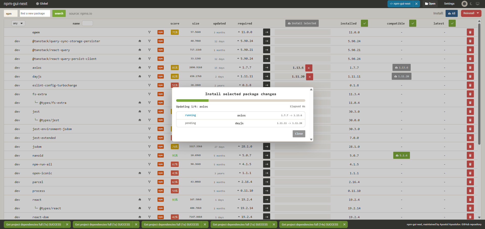

# npm-gui-next

`npm-gui-next` is the resurrection of the original `npm-gui` project after roughly three years of inactivity. It keeps the original idea intact, then modernizes the stack, restores maintenance, and continues development as a fork maintained by Apostol Apostolov.

`npm-gui-next` is a desktop-local web UI for managing JavaScript dependencies in real projects. It can inspect, install, remove, reinstall, and update packages using the package manager already used by the project: `npm`, `pnpm`, `yarn`, or `bun`.

<p align="center">
  
</p>

Repository: https://github.com/apoapostolov/npm-gui-next

## What It Does

- Opens a local web UI for the current project
- Detects and manages local project dependencies
- Supports global package view
- Shows installed, wanted, latest, score, size, and package metadata
- Updates packages one by one with visible progress
- Works with `npm`, `pnpm`, `yarn`, and `bun`

## Quick Start

Run the latest published version without a permanent install:

```bash
npx npm-gui-next@latest
```

Or install it globally:

```bash
npm install -g npm-gui-next
npm-gui-next
```

By default the app starts a local server and opens the UI in your browser.

## Requirements

- Node.js 20+
- npm 10+ recommended
- One of:
  - `bun`
  - `npm`
  - `pnpm`
  - `yarn`

For best results, run the tool on the native filesystem of the operating system you are using. On Windows, prefer a normal Windows path instead of a WSL `/mnt/c/...` path.

## Install And Run

### Linux

Install Node.js 20+ first. On Debian/Ubuntu, using NodeSource is a straightforward option:

```bash
curl -fsSL https://deb.nodesource.com/setup_20.x | sudo -E bash -
sudo apt-get install -y nodejs
```

Then run:

```bash
npx npm-gui-next@latest
```

Or:

```bash
sudo npm install -g npm-gui-next
npm-gui-next
```

### macOS

Install Node.js 20+ with Homebrew:

```bash
brew install node
```

Then run:

```bash
npx npm-gui-next@latest
```

Or:

```bash
npm install -g npm-gui-next
npm-gui-next
```

### Windows

Install Node.js 20+ from the official installer or with `winget`:

```powershell
winget install OpenJS.NodeJS.LTS
```

Then run from PowerShell or Windows Terminal:

```powershell
npx npm-gui-next@latest
```

Or:

```powershell
npm install -g npm-gui-next
npm-gui-next
```

For Windows, prefer a native path such as:

```text
C:\work\npm-gui-next
```

instead of a WSL-mounted path.

## Run From Source

Clone the repository and install dependencies:

```bash
npm install
```

Run the API server:

```bash
npm run dev:server
```

Run the client in another terminal:

```bash
npm run dev:client
```

Current development ports in this fork:

- API server: `http://localhost:3002`
- Client UI: `http://localhost:1234`

Open the UI in the browser at:

```text
http://localhost:1234
```

## Run As A Linux Service

For unattended local hosting on Linux, use `systemd`.

1. Install `npm-gui-next` globally:

```bash
sudo npm install -g npm-gui-next
```

2. Find the binary path:

```bash
which npm-gui-next
```

3. Create `/etc/systemd/system/npm-gui-next.service`:

```ini
[Unit]
Description=npm-gui-next
After=network.target

[Service]
Type=simple
User=youruser
WorkingDirectory=/home/youruser
ExecStart=/usr/bin/env npm-gui-next
Restart=on-failure
RestartSec=3
Environment=NODE_ENV=production

[Install]
WantedBy=multi-user.target
```

4. Enable and start it:

```bash
sudo systemctl daemon-reload
sudo systemctl enable npm-gui-next
sudo systemctl start npm-gui-next
```

5. Check status:

```bash
systemctl status npm-gui-next
journalctl -u npm-gui-next -f
```

If you want it bound to a specific working directory, set `WorkingDirectory` accordingly.

## Run As A Windows Service With NSSM

For unattended Windows use, `nssm` is the practical option.

1. Install `npm-gui-next` globally:

```powershell
npm install -g npm-gui-next
```

2. Install NSSM:

```powershell
winget install NSSM.NSSM
```

3. Find the executable path:

```powershell
where npm-gui-next
```

4. Create the service:

```powershell
nssm install npm-gui-next
```

Then configure:

- Path: the full path returned by `where npm-gui-next`
- Startup directory: the directory you want the tool to open from
- Arguments: leave empty unless you have a specific startup target

5. Start the service:

```powershell
nssm start npm-gui-next
```

6. Inspect it:

```powershell
nssm status npm-gui-next
```

To remove it later:

```powershell
nssm stop npm-gui-next
nssm remove npm-gui-next confirm
```

## Operational Notes

- Use native Windows paths on Windows.
- Use a real project directory containing `package.json`.
- `yarn` support requires `yarn.lock` in the project.
- Global package management depends on the package manager being installed and available on `PATH`.

## Project Status

This fork is actively maintained and is intended to continue the original project rather than merely mirror it. The current work includes UI fixes, modern dependency updates, dark mode support, and improved package update workflows.

## Authors

- Original project: [q-nick](https://github.com/q-nick)
- Resurrection and maintenance: [Apostol Apostolov](https://github.com/apoapostolov)

## Development Docs

Internal maintainer documentation lives in:

- `dev/README.md`

## License

MIT
